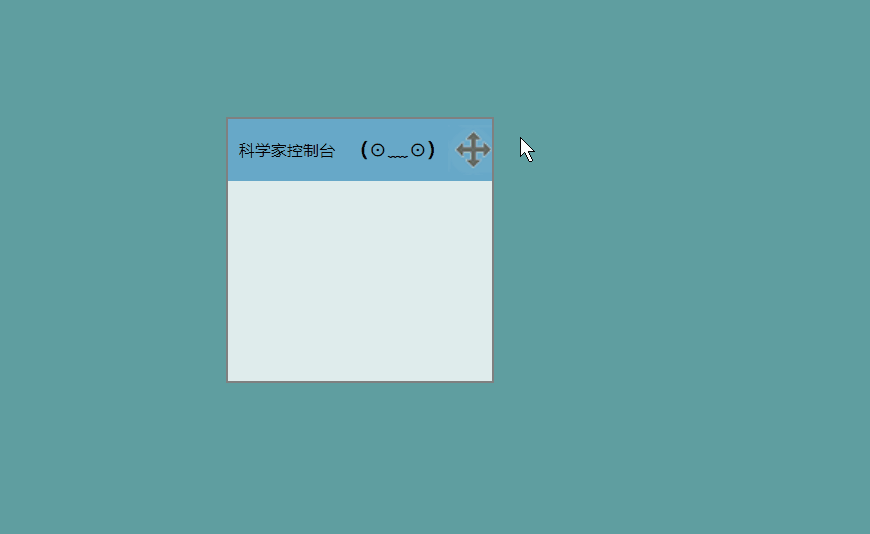

# web 工具地基
+ 给 web 工具、外挂或者脚本加个 gui

## 图片示例
+ 
+ 

## 项目目录
+ ./src 源码
+ ./dist 压缩后的代码

## 如何使用
+ 先导入(执行) ./dist 中的 wts.min.js ，此时会在全局上注册一个 _wts 属性
+ 首先执行 _wts.createSubgrade()
+ 然后 _wts.getLayer() 就能获取到这个 dom，在上面插入需要的 ui 即可

## api
+ 创建窗口 
    + _wts.createSubgrade()

+ 获取放置 dom 的层
    + _wts.getContainer()
    ``` javascript
    // 获取到 lyaer 后对 layer 进行一些 dom 操作即可
    const layer = _wts.getContainer()

    layer.appendChild(xxx)
    ```

+ 设置标题
    + _wts.setTitle('你的标题')

+ 设置背景色
    + _wts.setLayerBackgroundColor(css支持的颜色属性)


## 示例项目
+ 猫国仓库管理员
    + https://gitee.com/jiankesword/kittens-game-resource-administration

## 如何修改和构建源码
+ 首先在命令行中进入到这个项目的目录， 执行 npm install
+ 等依赖下载完成后， 就能修改 ./src 项目下面的源码了
+ 修改完成，执行 npm run build 进行构建（如果第一次构建需要运行两次 npm run build）

### 一边调试一边修改
+ 打开一个静态服务运行 test.html （推荐使用 VSCode 中的 Live Server 插件）
+ 然后在命令行运行 npm watch 
+ 此时修改代码的时候就能观察到修改效果了

## 更新
+ 2020.02.23
    + 把样式拆分到新的文件
    + 增加标题
+ 2020.02.24
    + 增加存档功能，保存上次控制面板的位置
+ 2020.02.26
    + 增加隐藏内容功能
+ 2020.02.29
    + 修复不能标题和样式 bug
